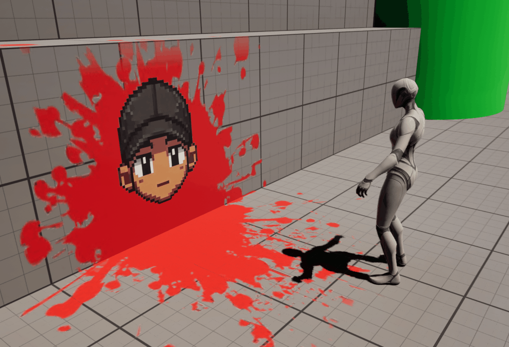
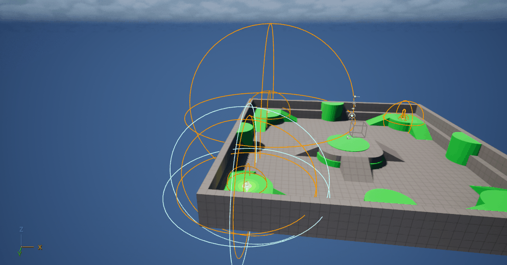

# 🧩 Unreal Engine Blueprint Showcase — Volume 8

A curated collection of **Unreal Engine 5.7.4** mini-projects — each one a focused, standalone system demonstrating clean, production-ready Blueprint design.
This sandbox contains **Projects 1–6**, wrapped together as a complete learning pack.
Each system is lightweight, modular, and built to scale into full gameplay features.

---

## 🎞️ Project Gallery

Explore the projects below 👇
Each entry includes a **Blueprint workflow**, **GIF preview**, and **feature breakdown** — perfect for learning, prototyping, or integrating directly into your own UE projects.

---

# Project 1: UE5 Footstep Sounds Using Physical Materials

## 🖼️ Preview

## 🧱 Features

**Physical Surface Detection**

- Uses **Line Trace by Channel** inside an Anim Notify to detect the surface beneath the player
- Retrieves the hit surface using **Get Surface Type**
- Uses **Switch on EPhysicalSurface** to determine which audio to trigger
- Footstep sound automatically adapts to the environment

**Custom Footstep Anim Notify**

- Custom **AN_Footsteps** blueprint created from the **AnimNotify** class
- Runs detection logic exactly when the character's foot contacts the ground
- Uses **Mesh Comp → Get Owner** to identify the player character
- Ignores the character during the trace using **Actors to Ignore**

**Surface Detection Line Trace**

- Trace starts at the character location
- Uses **Get Actor Up Vector** multiplied by a negative value to trace downward
- Trace length set to **150 units** to reliably detect ground surfaces
- Uses **Break Hit Result** to access the exact impact point for sound playback

**Dynamic Footstep Sound System**

- Three unique surface types implemented:
  - **Water**
  - **Rock**
  - **Zap (Hard Surface)**
- Uses **Play Sound at Location** to trigger audio at the exact footstep location
- Each surface triggers a unique Sound Cue

**Randomized Sound Cues**

- Footstep audio controlled through **Sound Cue graphs**
- Multiple audio clips connected to a **Random node** to prevent repetition
- **Modulator node** adds pitch and volume variation
  - Pitch: **0.8 – 1.2**
  - Volume: **0.85 – 1.0**
- Creates more natural sounding footsteps

**Physical Materials System**

- Custom physical materials created:
  - **PM_Rock**
  - **PM_Water**
  - **PM_Zap**
- Each material assigned a **Surface Type** in Project Settings
- Materials applied to world surfaces using **Phys Material Override**

**Animation Driven Footsteps**

- Footsteps triggered using animation notifies instead of movement speed
- **AN_Footsteps** placed on the **Surface_Footsteps notify track**
- Notifies aligned with **L and R foot contact markers**
- Ensures footsteps stay perfectly synchronized with animation

**Surface Testing Environment**

- Simple test level created using multiple **plane meshes**
- Each plane assigned a different surface material
- Allows easy testing of the dynamic footstep system across different surfaces

## 🚀 Result

The finished system dynamically detects the surface the player is walking on and plays the appropriate footstep sound in sync with the animation.

Because the system is built using **Physical Materials and Anim Notifies**, it is fully scalable. Additional surfaces, sounds, or effects like **particles, decals, or footprints** can be added without changing the core system, making it a flexible foundation for more advanced audio and gameplay interactions. 

---

# Project 2: Spawn Items From Breakable Objects

## 🖼️ Preview

## 🧱 Features

**Chaos Geometry Collection**

- Cube mesh converted into a Geometry Collection using Fracture Mode
- Uniform Fracture applied multiple times to generate breakable fragments
- Bone color visualization disabled for a normal mesh appearance
- Damage Threshold values configured to create layered break behavior
  - Index 0 → 1000
  - Index 1 → 100
  - Index 2 → 10
- Object positioned above the ground so gravity triggers a fracture on impact

**Breakable Actor Blueprint**

- Actor Blueprint created to control the breakable object logic
- Geometry Collection component added to the Blueprint
- Rest Collection assigned to the fractured Geometry Collection asset
- Chaos Physics **Notify Breaks** enabled to allow Blueprint event detection

**Spawnable Item Actor**

- Separate Actor Blueprint created to represent the item revealed after the object breaks
- Static Mesh component added to represent the spawned object
- Cylinder mesh used for demonstration
- Mesh scaled to fit the size of the fractured cube
- Collision preset set to **Overlap All** so the item does not interfere with debris or the player

**Chaos Break Event Logic**

- **On Chaos Break Event** used to detect when the Geometry Collection fractures
- **Do Once** node added to prevent multiple spawn triggers from fragment events
- **Spawn Actor From Class** node used to spawn the item Blueprint
- Collision handling set to **Always Spawn, Ignore Collisions**
- Break event data used to determine spawn location
- **Break Chaos Break Event** node extracts the fracture location
- Location converted using **Make Transform**
- Transform connected to the Spawn Actor node to place the item at the exact break position

**Debris Collision Handling**

- Custom **Debris** collision preset created in Project Settings
- Collision Enabled set to **Physics Only (No Query Collision)**
- Object Type set to **Destructible**
- Visibility, Camera, and Pawn traces set to **Ignore**
- Allows debris to simulate physics without blocking the player or camera

**Collision Profile Per Level**

- Geometry Collection configured with collision profiles per fracture level
  - Index 0 → None
  - Index 1 → Debris
  - Index 2 → Debris
- Ensures fractured pieces do not block player movement after the object breaks

## 🚀 Result

When the Geometry Collection fractures during gameplay, a Blueprint actor is spawned automatically at the exact location where the break occurred. This simple system can be expanded to reveal pickups, collectibles, or gameplay objects whenever destructible items break in the environment.

---

# Project 3 — Cloth Simulation Workflow (Blender → Unreal Engine 5)

## 🖼️ Preview

## 🧱 Features

**Blender Cloth Mesh Setup**

- Plane mesh created as base cloth surface
  - Default cube removed
  - Plane added via Shift + A → Mesh → Plane
- High-density geometry prepared for simulation
  - 40 loop cuts applied horizontally
  - 40 loop cuts applied vertically
  - Even topology ensures smooth bending and realistic cloth behavior
- Mesh exported as FBX
  - Clean export ready for Unreal import pipeline

**Skeletal Mesh Import for Cloth System**

- FBX imported into Unreal Engine as Skeletal Mesh
  - Required for Chaos Cloth compatibility
- Cloth mesh prepared for physics-based simulation
  - Integrated with Unreal’s cloth workflow pipeline

**Cloth Data Creation & Paint System**

- Clothing Data asset generated from mesh section
  - Linked to physics system for simulation
- Cloth painting used to define simulation areas
  - Full mesh painted white to enable complete cloth movement
  - Non-simulated (pink) regions avoided for full dynamic behavior

**Chaos Cloth Configuration**

- Collision thickness adjusted
  - Set to 12 to prevent clipping through surfaces
- Cloth behavior tuned through ChaosClothConfig
  - Improves realism and surface interaction

**Physics & Environment Interaction**

- Simulate Physics enabled on skeletal mesh
  - Allows real-time cloth movement in scene
- Environment collision activated
  - Cloth interacts with external meshes (e.g., table)
- Force Collision Update enabled
  - Ensures consistent collision accuracy during motion
  - Balanced with performance considerations

**Material Application**

- Custom texture applied to cloth mesh
  - Tablecloth pattern imported as PNG
  - Material assigned directly to skeletal mesh
- Optional default material setup via asset details
  - Ensures consistent appearance across instances

## 🚀 Result

A fully simulated, game-ready cloth system built in Blender and integrated into Unreal Engine 5 using Chaos Cloth, capable of dynamic interaction with environment objects and enhanced with custom materials for visual fidelity. 

---

# Project 4: SCP-178 Glasses System

## 🖼️ Preview

## 🧱 Features

**Post Process Visual Shift**

- Post Process Volume configured with Infinite Extent (Unbound)
- Blend Weight controlled dynamically for activation
- Saturation reduced to near black for visual suppression
- Gain adjusted to apply strong red tint for altered perception effect

**Glasses Interaction System**

- BP_Glasses actor created with static mesh component
- BPI_Interact interface used for interaction handling
- Line Trace system implemented from Camera Boom for detection
- Interface validation ensures only interactable actors respond

**Pickup & Attachment Logic**

- Glasses attach to character using Glasses_Socket on head bone
- Transform aligned using preview asset for accurate placement
- Collision disabled on pickup to prevent physics conflicts
- Attachment rules set to Snap to Target for clean positioning

**Hidden Entity Setup (BP_178)**

- Actor created with Skeletal Mesh (Manny) and animation blueprint
- Actor Hidden In Game enabled by default
- Collision set to Physics Actor for physical presence
- Scaled for exaggerated visual impact

**Entity Reveal System**

- Post Process effect triggered on interaction
- Delay used to control reveal timing
- BP_178 referenced and validated at runtime
- Actor visibility toggled off → on for reveal

**Dynamic Spawn Positioning**

- Entity positioned using player forward vector offset
- Location calculated using Vector + Vector math
- Z axis constrained to ground level for stability
- Adjustable distance for gameplay tuning

**Facing Rotation Logic**

- Find Look At Rotation used for player-facing alignment
- Rotation adjusted with Yaw offset for mesh correction
- Applied using Set Actor Rotation for precise orientation

**Death Sequence System**

- Camera fade triggered via Player Camera Manager
- Smooth fade from 0 → 1 alpha over defined duration
- Scream audio played at entity location
- Sequence node used to synchronize effects

**Level Reset**

- Delay matches fade/audio duration
- Open Level node reloads current map
- Creates immediate and final gameplay loop

## 🚀 Result

A clean, modular SCP-inspired system where interacting with a pair of glasses shifts the player's perception, revealing a hidden entity that triggers an unavoidable death sequence. Built as a strong foundation for expanding into horror mechanics, perception-based gameplay, or layered reality systems.

---

# Project 5: Decal System

## 🖼️ Preview

## 🧱 Features

**Decal Texture Setup**

- PNG image imported with transparency support
- Clean alpha used for smooth edge blending
- Texture prepared for projection without background artifacts

**Material Configuration**

- Material created using M_Decal naming convention
- Material Domain set to Deferred Decal
- Blend Mode set to TranslucentGreyTransmittance
- Texture RGB connected to Base Color
- Alpha channel connected to Opacity Override
- Texture sample converted to parameter (Decal_Base)

**Material Instance Workflow**

- Material Instance created for flexible reuse
- Texture parameter exposed for quick swapping
- Multiple decals supported without duplicating materials

**Decal Placement System**

- Material Instance dragged into level to create decal actor
- Transform tools used for positioning and alignment
- Decal projection adjusted to fit surface correctly

**Character Decal Control**

- Disabled Receives Decals on ThirdPersonCharacter mesh
- Prevents unintended projection onto player character

**Dynamic Decal Swapping**

- Texture parameter overridden inside Material Instance
- New decal images applied instantly without rebuilding setup
- Supports rapid iteration and variation

## 🚀 Result

<<<<<<< HEAD
A flexible decal system that allows fast projection of surface details like markings, damage, and stylized graphics without modifying base meshes or materials. 

--- 

# Project 6: Audio Attenuation System

## 🖼️ Preview

## 🧱 Features

**BP_Lightbulb — Basic Attenuation**

- Point Light added as visual sound source reference
  - Color adjusted for visibility
- Audio Component configured
  - Looping enabled for continuous playback
  - Auto Activate enabled for immediate playback
- Sound Attenuation (SA_Sound1)
  - Inner Radius set to 250
  - Falloff Distance set to 600
  - Sphere shape used for even sound distribution
  - Volume Attenuation enabled
  - Spatialization enabled using Panning
- Result
  - Clear transition between full volume and falloff range
  - Sound fades naturally based on player distance

---

**BP_Wind — Air Absorption System**

- Text Render component added for in-world labeling ("Wind")
- Audio Component configured with looping wind sound
- Sound Attenuation (SA_Sound2)
  - Inner Radius set to 500
  - Falloff Distance set to 1400
- Air Absorption enabled
  - Min Distance Range set to 300
  - Max Distance Range set to 1500
  - Low Pass Cutoff Frequency Min set to 20000
  - Low Pass Cutoff Frequency Max set to 5000
- Result
  - Sound not only fades with distance but becomes muffled
  - High frequencies are reduced over distance for realism
  - Creates a more natural “traveling through space” effect

---

**BP_Voices — Binaural Spatialization**

- Static or Skeletal Mesh added to represent sound origin
- Audio Component configured with looping voice/whisper audio
- Sound Attenuation (SA_Sound3)
  - Inner Radius set to 100
  - Falloff Distance set to 300
- Spatialization upgraded to Plugin-Spatialized (Binaural)
  - Binaural Radius set to 200
  - Non-Spatialized Radius Start set to 0
  - Non-Spatialized Radius End set to 100
- Result
  - Highly directional and immersive sound behavior
  - Sound shifts naturally as player rotates
  - Enhanced realism when using headphones

---

## 🚀 Result

This project demonstrates three distinct approaches to Unreal Engine audio attenuation:

- Basic distance-based volume control
- Frequency-based air absorption over distance
- Advanced binaural spatialization for immersive 3D audio

Together, these systems showcase how sound can be shaped to feel grounded, reactive, and spatially accurate within a game world.
=======
A flexible decal system that allows fast projection of surface details like markings, damage, and stylized graphics without modifying base meshes or materials.
>>>>>>> 55b5c6f563513e37388883ace692f338bd9f42c1
